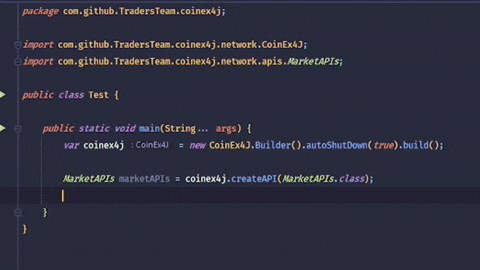

# CoinEx4j Library

**CoinEx Exchange API JVM Library**

---

|Icon|      Item                          |
| :---:|:-------------------------------: |
|📺| [**Preview**](#Preview)             |
|📱| [**Compatibility**](#Compatibility) |
|💻| [**Usage**](#Usage)                 |
|📩| [**Download**](#Download)           |
|📋| [**Features**](#Features)           |
|🧾| [**Changelog**](#Changelog)         |
|⚖️| [**License**](#License)             |

---

## Preview



CoinEx4j is a JVM(Java, Kotlin, etc) library for using [CoinEx Exchange API](https://github.com/coinexcom/coinex_exchange_api/wiki). This library aims to provide an easy-to-use abstraction over official API.

## Compatibility

**JVM11+**

## Usage

Read documentation here: [](https://javadoc.io/doc/io.github.TradersTeam/CoinEx4J) 

First create a client like this, but keep in mind this will give you a default client with predefined configurations.

```java
CoinEx4J coinEx4J = new CoinEx4J.Builder().build();
```

You can customize your client like this:

```java
CoinEx4J coinEx4J = new CoinEx4J.Builder()
        .autoShutDown(true)
        .accessId("...")
        .secretKey("..")
        .okhttp(...)
        .retrofit(..)
        .baseUrl(...)
        .addConverter(...)
        .build();
```

If you are using this library in JVM only (not Android) like in console for debugging or a server it's suggested to
enable `autoShutDown` otherwise JVM may or may not exit after task completion depending on `OkHttp` client
timeout, [more info here](https://github.com/square/retrofit/issues/3144).

After creating your client then you need to define the API group that you want to use, which are actually retrofit
interfaces.

```java
MarketAPIs marketAPIs = coinEx4J.createAPI(MarketAPIs.class);
```

Then you can use different sub APIs under that group.

```java
marketAPIs.getMarketsInfo().asyncBody(coinEx4J, (response,error) -> {
        System.out.println(response.data());
        });
```

Custom callbacks are provided using retrofit call adapter feature and Java `Consumer` class however you can still
use `enqueue` and `execute` methods. callbacks can be called from Kotlin too. different types of callbacks are explained
here.

|Callback|Info|
|:-------:|:----------|
|**async**|returns a callback with type of `BiConsumer` with `Response<T>` and `Throwable` parameters |
|**asyncCall**|returns two callbacks, one for success (`BiConsumer` with `Call<T>` and `Response<T>` parameters) and another for failure (`BiConsumer` with `Call<T>` and `Throwable` parameters)|
|**asyncBody**|returns a callback with type of `BiConsumer` with `T` and `Throwable` as parameters|

`T` is response body type.

## Download

Find the latest version from [Maven Artifact](https://repo1.maven.org/maven2/io/github/TradersTeam/CoinEx4J/maven-metadata.xml)

### Gradle Groovy DSL

**Step 1.** Add the Maven repository to your build file  
Add it in your root build.gradle at the end of repositories:

```groovy
repositories {
    mavenCentral()
}
```

**Step 2.** Add the dependency

```groovy
dependencies {
    implementation 'io.github.TradersTeam:CoinEx4J:$coinex4j_last_version'
}
```

### Maven

Add the dependency

```xml
<dependency>
    <groupId>io.github.TradersTeam</groupId>
    <artifactId>CoinEx4J</artifactId>
    <version>$coinex4j_last_version</version>
    <type>aar</type>
</dependency>  
```

### Gradle Kotlin DSL

```groovy
dependencies {
    implementation("io.github.TradersTeam:CoinEx4J:$coinex4j_last_version")
}
```

## Features

### HTTP APIs

- [x] [Common APIs](https://github.com/TradersTeam/coinex4j/projects/1)
- [x] [Market APIs](https://github.com/TradersTeam/coinex4j/projects/2)
- [ ] [Account APIs](https://github.com/TradersTeam/coinex4j/projects/3)
- [ ] [Trading APIs](https://github.com/TradersTeam/coinex4j/projects/5)
- [ ] Margin APIs
- [ ] Contract APIs

### WebSocket APIs

- [ ] System APIs
- [ ] Market APIs
- [ ] Trading APIs

### Perpetual APIs

#### [Perpetual HTTP](https://github.com/TradersTeam/coinex4j/projects/4)

- [x] Common APIs (System)
- [x] System APIs
- [ ] [Market APIs](https://github.com/TradersTeam/coinex4j/issues/37)
- [ ] Asset APIs
- [ ] [Order APIs](https://github.com/TradersTeam/coinex4j/issues/38)
- [ ] Position APIs

#### Perpetual WebSocket

- [ ] Server APIs
- [ ] Market APIs
- [ ] Asset APIs
- [ ] Order APIs
- [ ] Position APIs

## Changelog

- [1.0.2](https://github.com/TradersTeam/coinex4j/releases/tag/1.0.2)
- [1.0.1](https://github.com/TradersTeam/coinex4j/releases/tag/1.0.1)
- [1.0.0](https://github.com/TradersTeam/coinex4j/releases/tag/1.0.0)

## License

> CoinEx4J is licensed under the **[GNU General Public License v3.0](./LICENSE)**  
> Permissions of this strong copyleft license are conditioned on making  
> available complete source code of licensed works and modifications,  
> which include larger works using a licensed work, under the same  
> license. Copyright and license notices must be preserved. Contributors  
> provide an express grant of patent rights.

## Contributors

<table>
  <tr>
    <td align="center"><a href="https://github.com/yamin8000"><br /><sub><b>YaMiN</b></sub></a><br /><a href="https://github.com/yamin8000/Fare/commits?author=yamin8000" title="Code"></a></td>
    <td align="center"><a href="https://github.com/ariantron"><br /><sub><b>ArianTron</b></sub></a><br /><a href="https://github.com/ariantron" title="Code"></a></td>
  </tr>
</table>
